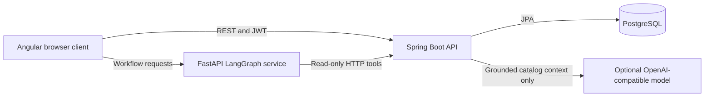
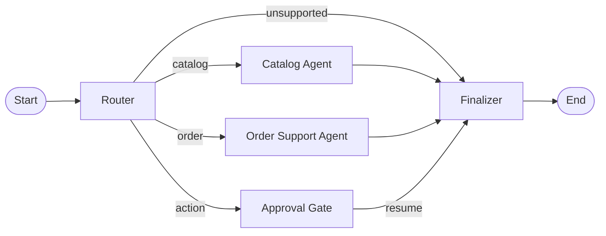

# Full-Stack E-Commerce Application: Complete Project Documentation

## 1. Project Summary

This repository contains a full-stack e-commerce application with separate frontend, backend, database, and AI-orchestration services. Customers can register and sign in, browse and search products, manage a persistent cart, check out, and view their order history. Administrators can manage products, upload product images, and view orders.

The project also demonstrates two bounded AI capabilities:

1. A Spring Boot shopping-assistant API that grounds answers in live catalog retrieval and can use either a deterministic demo provider or an optional OpenAI-compatible model provider.
2. A standalone Python LangGraph service that coordinates catalog and order-support requests through typed, read-only tools, maintains checkpointed session state, and pauses action-like requests for human approval.

The application is intentionally designed so that AI is never the authority for authentication, authorization, pricing, inventory, business mutations, or database access. Angular, Spring Boot, and PostgreSQL remain the transactional e-commerce system; the AI layer is an assistive and orchestration boundary.

## 2. Repository Layout

```text
ecommerce-app/
|-- backend/                    Spring Boot REST API and business system
|   |-- src/main/java/com/ecommerce/
|   |   |-- ai/                 Grounded assistant and enrichment APIs
|   |   |-- config/             Application configuration
|   |   |-- controller/         REST controllers
|   |   |-- dto/                Request and response models
|   |   |-- entity/             JPA domain model
|   |   |-- exception/          Error handling
|   |   |-- repository/         Spring Data repositories
|   |   |-- security/           JWT and Spring Security configuration
|   |   `-- service/            Business services
|   `-- src/test/               Backend tests
|-- frontend/                   Angular customer and administrator UI
|   `-- src/app/
|       |-- core/               Auth, HTTP interceptor, data services, models
|       |-- features/           Auth, home, products, cart, checkout, profile, admin
|       `-- shared/             Reusable UI such as navbar, product card, AI chat
|-- agent-service/              FastAPI, LangChain, and LangGraph workflow service
|   `-- app/
|       |-- main.py             HTTP API and request validation
|       |-- graph.py            Directed workflow, nodes, routing, checkpoints
|       |-- prompts.py          Role and policy prompt definitions
|       |-- state.py            Shared typed workflow state
|       `-- tools.py            Read-only Spring API tool definitions
|-- docs/ai-architecture/       Focused AI assignment and evidence documents
|-- docker-compose.yml          Local multi-service deployment
|-- pom.xml                     Root Maven multi-module build
`-- README.md                   Setup and endpoint overview
```

## 3. Technology Stack

| Area | Technology | Version or implementation | Role in the project |
| --- | --- | --- | --- |
| Frontend | Angular | Angular 15.2 | Browser UI, routing, forms, HTTP requests, customer and admin screens. |
| Frontend language | TypeScript | 4.9 | Typed application and component code. |
| Frontend reactive layer | RxJS and Zone.js | RxJS 7.8, Zone.js 0.12 | Angular asynchronous HTTP and change-detection support. |
| Backend | Spring Boot | 3.5.15 | REST API, validation, business logic, security, AI assistant API, persistence integration. |
| Backend language | Java | 25 | Backend runtime and application code. |
| Persistence | Spring Data JPA and Hibernate | Spring Boot managed | Object-relational mapping and repository abstraction. |
| Database | PostgreSQL | 16 Alpine in Docker Compose | Stores users, products, categories, carts, orders, and order items. |
| Authentication | Spring Security and JJWT | JJWT 0.11.5 | Stateless JWT login, token validation, access control, and protected routes. |
| API documentation | springdoc-openapi | 2.5.0 | Swagger UI and OpenAPI JSON for the Spring API. |
| Mapping and code reduction | MapStruct and Lombok | MapStruct 1.6.3, Lombok 1.18.46 processor | DTO mapping and reduced Java boilerplate. |
| Python agent API | FastAPI and Pydantic | FastAPI 0.115.12 | LangGraph service HTTP boundary and validated request schemas. |
| Agent HTTP client | HTTPX | 0.28.1 | Calls allow-listed Spring Boot APIs from typed tools. |
| Agent tools | LangChain Core | 0.3.80 | Defines typed `@tool` functions. |
| Agent orchestration | LangGraph | 0.4.7 | Stateful graph routing, checkpoints, interrupts, and resume workflow. |
| Python application server | Uvicorn | 0.34.2 | Hosts the FastAPI service. |
| Containers | Docker and Docker Compose | Repository Dockerfiles and Compose file | Runs PostgreSQL, backend, frontend, and agent service together. |
| Frontend serving | Nginx | Frontend container | Serves the production Angular build. |
| Build tools | Maven, Angular CLI, npm | Maven multi-module build and Angular CLI 15 | Builds and validates backend and frontend code. |

## 4. High-Level Architecture



The components have distinct responsibilities:

- **Angular** presents customer and administrator workflows. It contains the core authentication, HTTP interceptor, product, cart, order, and AI client services.
- **Spring Boot** is the system of record. It owns identity, JWT validation, authorization, product lifecycle, cart persistence, stock validation, checkout, order records, and the grounded assistant endpoint.
- **PostgreSQL** stores durable e-commerce data. Neither the LangGraph service nor an LLM accesses it directly.
- **FastAPI/LangGraph** is a separate orchestration boundary. It dispatches a limited set of customer-support workflows and invokes Spring APIs only through explicitly defined read-only tools.
- **The optional model provider** is used by the Spring assistant only after relevant product records have been retrieved. It is not required for the default demonstrator to start.

## 5. E-Commerce Functional Scope

### Customer capabilities

- Register and sign in with JWT authentication.
- Browse the product catalog, search or filter products, and inspect product details.
- Add products to a persistent cart, change quantities, and remove items.
- Check out and create an order.
- View profile information and personal order history.
- Ask grounded shopping-assistant questions and receive product references.

### Administrator capabilities

- Access administrator-only screens through route guards and backend role checks.
- Create, edit, and delete product records.
- Upload product images.
- View the administrator order dashboard.
- Request non-persisting product enrichment suggestions for titles, descriptions, tags, categories, and image alt text.

### Core REST API areas

| Area | Main endpoints | Purpose |
| --- | --- | --- |
| Authentication | `POST /api/auth/register`, `POST /api/auth/login` | Create accounts and issue JWTs. |
| Current user | `GET /api/users/me` | Retrieve the authenticated profile. |
| Products | `GET /api/products`, `GET /api/products/{id}` | Public product discovery and details. |
| Product administration | `POST`, `PUT`, `DELETE /api/products/{id}` and image upload | Protected catalog management. |
| Cart | `GET`, `POST`, `PUT`, `DELETE /api/cart...` | Authenticated persistent cart operations. |
| Orders | `POST /api/orders/checkout`, `GET /api/orders` | Checkout and personal order history. |
| Admin orders | `GET /api/orders/admin/all` | Administrator order visibility. |
| Grounded assistant | `POST /api/ai/assistant` | Catalog-grounded shopping response. |
| Product enrichment | `POST /api/ai/admin/product-enrichment` | Admin-only deterministic suggestions. |

## 6. Data and Security Model

The JPA domain represents users, roles, products, categories, cart items, orders, and order items. Spring Data repositories and service-layer logic provide persistence and enforce business rules.

Authentication is stateless. After successful login, the backend issues a JWT. The Angular authentication service retains session information, and its JWT interceptor attaches the bearer token to applicable API requests. Spring Security validates the token and independently enforces ownership and administrator authorization. The AI services never infer user identity from a natural-language message; protected data access is delegated to the Spring API with the supplied bearer token.

This separation is essential for the AI design: an instruction in a prompt cannot elevate permissions, reveal another customer's orders, change a price, or bypass checkout validation.

## 7. AI Capabilities Overview

The repository contains two complementary AI-related designs. They should not be conflated.

| Capability | Location | Primary purpose | Uses an LLM at runtime? |
| --- | --- | --- | --- |
| Grounded shopping assistant | Spring Boot `com.ecommerce.ai` package | Retrieve catalog references and produce a shopping answer. | Optionally, when `AI_PROVIDER=openai-compatible`; otherwise uses deterministic demo text. |
| Product enrichment | Spring Boot `AiProductEnrichmentService` | Suggest title, description, category, tags, and alt text for administrators. | No. It is deterministic string and token processing. |
| Stateful customer workflow | `agent-service/app` | Route catalog/order/action requests, use grounded read-only tools, and manage approvals. | Yes. Catalog and Order Support specialists use `ChatOpenAI.bind_tools(...)`; routing and approval policy remain deterministic. |
| Development assistance | Prompt log and evidence documentation | Describe how GitHub Copilot and Claude Code assisted implementation and review. | Not an application runtime feature. |

## 8. Grounded Shopping Assistant

### Request and response flow

`POST /api/ai/assistant` accepts a JSON body with a required `question` limited to 500 characters. `AiShoppingAssistantService` performs this sequence:

1. Calls `ProductSearchService.search(question, 3)`.
2. Receives catalog references from `KeywordProductSearchService`.
3. Passes the question and only those references to the selected `AiProvider`.
4. Returns an answer, recommendations, the same references as sources, and the provider name.

The response explicitly carries product provenance. Recommendations and sources are derived from the retrieved `AiProductReference` objects rather than from unconstrained model claims.

### Retrieval behavior

The default `KeywordProductSearchService` is a retrieval-grounding baseline compatible with JPA and PostgreSQL. It:

- Normalizes the question to lowercase and tokenizes on non-alphanumeric characters.
- Removes a small stop-word set and ignores one-character terms.
- Searches each active, in-stock product's name, description, and category name.
- Scores products by the number of matching query terms.
- Sorts by descending score, then product name.
- Returns a capped number of references containing product ID, name, category, price, image URL, stock quantity, and `catalog` source label.

Inactive or out-of-stock products are filtered before any answer is formed. The current architecture deliberately uses keyword retrieval. A future `PgVectorProductSearchService` may use embeddings and PostgreSQL pgvector behind the same `ProductSearchService` interface, retaining keyword retrieval as a fallback; pgvector and embeddings are not required by the present implementation.

### Provider modes

#### Demo provider

`DemoAiProvider` is enabled by default when `AI_PROVIDER=demo` or when the setting is absent. It performs no external model request. It returns a deterministic message that lists matching in-stock product names or states that no matching catalog product was found. This lets the project run locally without an AI API key.

#### OpenAI-compatible provider

`OpenAiCompatibleProvider` is enabled only when `AI_PROVIDER=openai-compatible`. It requires `AI_API_KEY`, uses Spring's `RestClient`, and calls the configured `/chat/completions` endpoint with the configured model name, defaulting in Compose to `gpt-4o-mini`.

The provider uses temperature `0` and constructs a two-message chat request:

```text
System: Answer only from the supplied catalog. Do not invent prices, availability,
policies, or attributes.

User: Question: <customer question>
Catalog:
<retrieved name | price | stock records>
```

This is the actual LLM-facing prompt pattern in the backend. The model receives the customer's question plus a bounded catalog context, rather than unrestricted database content or privileged credentials. The API still returns the original structured sources so a UI can present factual provenance alongside generated text.

### Deterministic product enrichment

`POST /api/ai/admin/product-enrichment` accepts a bounded title, optional description/category/image URL, and generates suggestions without an LLM. It title-cases input, produces up to five token-derived tags, supplies an `Uncategorized` fallback, and returns reviewable descriptive and alt-text suggestions. The response includes the notice: suggestions must be reviewed and applied in the product form before saving. This endpoint does not persist product changes.

## 9. LangGraph Customer-Support Workflow

The Python service provides a separate workflow API:

- `GET /health`
- `POST /workflow`
- `POST /workflow/{sessionId}/resume`

The create-workflow request validates a required `request` field with a maximum length of 500 characters. Resume requests only accept `approved`, `rejected`, or `revise`, and optional feedback is capped at 500 characters.

### Workflow graph



`WorkflowState` is a typed shared state object containing the customer request, optional bearer token, intent, messages, retrieved products/orders, draft/final answers, approval request, decision, and feedback. LangGraph's `MemorySaver` checkpointer stores graph state under the session-specific `thread_id`. This preserves a paused approval request until the client resumes the exact session.

### Deterministic routing

The current router is code-based, not model-based. It classifies lowered request text as follows:

| Route | Trigger examples | Result |
| --- | --- | --- |
| `action` | `cancel`, `refund`, `change address`, `checkout`, `place order` | Pause for human approval. |
| `order` | `order`, `delivery`, `shipping`, `track` | Use authenticated order lookup. |
| `catalog` | `product`, `recommend`, `laptop`, `phone`, `price`, `catalog` | Use catalog product search. |
| `unsupported` | No matching routing keyword | Return a bounded list of supported topics. |

This is intentionally simple and inspectable for the demonstrator. It avoids treating a model classification as an authorization or policy decision.

### Typed, allow-listed tools

LangChain Core decorates the following Python functions with `@tool`:

| Tool | Inputs | Spring API call | Constraints |
| --- | --- | --- | --- |
| `search_products` | Query and optional limit | `GET /api/products?search=...` | Read-only; limit constrained to 1 through 5. |
| `get_product` | Product ID | `GET /api/products/{id}` | Read-only. Defined for specialist use. |
| `get_my_orders` | JWT bearer token | `GET /api/orders` | Read-only; Spring Boot validates the token and enforces ownership. |

The catalog and order-support nodes are LLM specialists with their role prompts included as system messages. Each binds only its least-privilege LangChain tools: Catalog can select `search_products` or `get_product`; Order Support can select `get_my_orders`. `ToolNode` executes requested calls and loops results back to the same specialist, which produces the grounded response. The authenticated token is injected from graph state and is not exposed in the order-tool schema.

### Approval and human-in-the-loop behavior

Potentially consequential language routes to `approval_gate`. The gate calls LangGraph `interrupt()` with a proposal that includes the original request and the approval policy. The response payload reports `awaiting_approval` while the interrupt exists.

To continue, a UI or test client posts to `/workflow/{sessionId}/resume`. LangGraph resumes the preserved checkpointed state with an allowed decision:

- `approved`: records approval and states that Spring Boot must still independently authorize and execute any action.
- `rejected`: records that no action was taken.
- `revise`: records feedback and confirms that no action was taken.

The current demonstrator deliberately performs no order, payment, shipping, refund, or checkout mutation after approval. A production workflow would need a separately implemented, authenticated Spring endpoint that repeats authorization and business-rule validation.

## 10. Runtime Role Prompts

`agent-service/app/prompts.py` defines role prompts for the workflow. They document intended constraints and provide the approval policy text returned in an interrupt payload.

| Prompt role | Core instruction |
| --- | --- |
| Router | Classify as catalog, order, action, or unsupported; never authorize an action. |
| Catalog Agent | Use only returned catalog records; cite exact IDs, names, prices, and stock; do not invent product facts. |
| Order Support Agent | Use only authenticated order-tool records; do not expose another customer's data or mutate an order. |
| Approval Gate | Pause any request that may change an order, payment, shipping address, or checkout state for explicit human approval. |

### Important implementation note

`CATALOG_SYSTEM_PROMPT` and `ORDER_SYSTEM_PROMPT` are passed to the corresponding `ChatOpenAI` specialist on every turn and constrain grounded answers. The deterministic router remains deliberately narrow: it only chooses a least-privilege specialist or the approval gate. `APPROVAL_SYSTEM_PROMPT` is attached to the interrupt proposal as a policy field. This keeps model-driven tool selection separate from authorization and critical-action control.

## 11. How AI Was Used During Development

The repository's AI-assisted development evidence records two separate development assistants:

- **GitHub Copilot** was the primary in-editor implementation assistant. It was used for inline completions, chat generation, repetitive scaffolding, small refactors, test skeletons, and debugging support.
- **Claude Code / Claude Sonnet** was used as an architecture and review assistant. It was used for cross-layer planning, security and endpoint consistency review, workflow design, missing-class identification, and documentation synthesis.

This development assistance is distinct from the application's runtime features. Development models helped author and review source code; they are not automatically invoked when an e-commerce customer uses the deployed application.

### Development collaboration pattern

1. Claude Code was prompted to plan architecture, dependencies, package layouts, and cross-cutting flows.
2. GitHub Copilot was prompted to generate implementation details such as entities, DTOs, controllers, services, guards, templates, and repositories.
3. Claude Code was used to review integrated behavior, particularly JWT security, endpoint consistency, checkout flow, and assignment coverage.
4. GitHub Copilot helped polish local edits, resolve imports or type mismatches, and scaffold tests.
5. Both tools helped turn implementation notes into documentation and prompt evidence.

### AI-assisted implementation areas

| Area | Typical assistant role | Resulting project surface |
| --- | --- | --- |
| Initial structure | Claude Code architecture planning | Separate frontend, backend, agent-service, and documentation layout. |
| Maven configuration | GitHub Copilot Chat | Spring starters, PostgreSQL, JWT, MapStruct, Lombok, OpenAPI, and tests. |
| Domain model | GitHub Copilot Inline | JPA entity scaffolds and relationship boilerplate. |
| JWT security | Claude Code design plus Copilot implementation | Security configuration, JWT filter, token provider, user details components. |
| Business services | Claude Code planning plus Copilot code generation | Product CRUD, cart persistence, checkout, and order history services. |
| Angular UI | GitHub Copilot Chat and Inline | Routing, services, guards, interceptor, forms, product/card views, cart, checkout, and admin screens. |
| Testing | GitHub Copilot Chat | JUnit 5/Mockito skeletons and edge-case suggestions. |
| Documentation | Claude Code and GitHub Copilot Chat | README, AI architecture, safety, evaluation, hooks, and prompt record. |
| Environment upgrades | GitHub Copilot Agent | Java 25/Spring Boot 3.5.15 upgrade and frontend build-environment fixes, as recorded in the prompt log. |

## 12. Development Prompting Approach

The development prompt log uses task-focused prompts. Each prompt identifies a concrete artifact, required technologies, core constraints, and expected behavior. This produces better results than asking for an entire system in one request because the generated result can be inspected and validated in the context of the owning layer.

### Reusable prompt structure

```text
Context: <current file, layer, or existing domain model>
Task: <specific class, component, endpoint, or workflow to create/review>
Constraints: <framework, security rules, validation, data ownership, API contract>
Expected result: <methods, files, tests, or explanation needed>
Validation: <build, test, endpoint behavior, or review criteria>
```

### Representative development prompts

| Phase | Tool | Prompt intent | Prompt example |
| --- | --- | --- | --- |
| Project setup | Claude Code | Establish repository and package shape. | `Design a clean folder structure for a full stack e-commerce app using Angular, Spring Boot, PostgreSQL, and JWT. Include the packages and folders I should create first.` |
| Backend bootstrap | GitHub Copilot Chat | Configure backend dependencies. | `Generate a Maven pom.xml for Spring Boot with Web, Data JPA, Security, Validation, PostgreSQL, Lombok, JWT, MapStruct, OpenAPI, and test dependencies.` |
| User model | GitHub Copilot Inline | Create the core account entity. | `Generate a Spring Boot JPA entity for User with first name, last name, email, password, enabled flag, timestamps, and roles stored as an enum collection.` |
| Catalog model | GitHub Copilot Inline | Model e-commerce relationships. | `Create Product, Category, CartItem, Order, and OrderItem entities with realistic e-commerce relationships and audit timestamps.` |
| Security design | Claude Code | Plan a secure JWT flow. | `Explain the cleanest JWT authentication flow for this app and list the Spring Security classes I need.` |
| Authentication API | GitHub Copilot Chat | Generate bounded auth endpoints and DTOs. | `Generate LoginRequest, RegisterRequest, AuthResponse, and an AuthController with register/login endpoints using AuthenticationManager and JWT.` |
| Service planning | Claude Code | Define business service boundaries. | `Review my entities and tell me what service methods I need for product CRUD, persistent cart operations, checkout, and order history.` |
| Product API | GitHub Copilot Chat | Build public and admin controller mappings. | `Create a ProductController with public GET endpoints, admin-only POST/PUT/DELETE endpoints, and a multipart image upload endpoint.` |
| Checkout | Claude Code | Reason about transaction order and invariants. | `Walk me through the checkout logic so stock is validated, cart items become order items, totals are calculated, and the cart is cleared.` |
| Angular structure | GitHub Copilot Chat | Create client architecture. | `Create an Angular app structure with routing, feature folders, guards, interceptors, and shared components for an e-commerce app.` |
| Client auth | GitHub Copilot Inline | Implement client-side auth state. | `Generate an AuthService that stores JWT/user info in localStorage, exposes login/register/logout, and supports an admin role check.` |
| Cart and checkout UI | GitHub Copilot Chat | Create reactive-form workflow. | `Create Angular components for cart and checkout using reactive forms and connect them to cart/order services.` |
| Test generation | GitHub Copilot Chat | Scaffold focused tests. | `Write JUnit 5 tests for ProductService using Mockito. Cover create product, get product by id, and missing product errors.` |
| Documentation | Claude Code | Synthesize assignment evidence. | `Create AI-assisted development documentation that looks authentic for a student project, including agents, skills, hooks, and a detailed prompt log.` |

The detailed chronological record, including outcomes for each prompt, is retained in `docs/ai-architecture/prompt-log.md`.

## 13. AI Guardrails and Safety Controls

The project uses defense in depth. Prompts communicate desired behavior, but technical controls enforce it.

| Risk or control objective | Implemented control |
| --- | --- |
| Hallucinated catalog facts | Retrieve product data first; restrict the OpenAI-compatible provider's system instruction to supplied catalog context; return structured sources. |
| Inventory leakage | Search filters inactive and zero-stock products before response generation. |
| Unauthorized order data | `get_my_orders` calls the protected Spring endpoint with a bearer token; Spring validates ownership. |
| Unauthorized mutations | Agent tools are read-only; action-like requests interrupt; the demonstrator has no mutation call. |
| Prompt-based privilege escalation | Spring Security, JWT validation, roles, service validation, and backend endpoints remain authoritative. |
| Excessive input | Assistant and workflow requests are limited to 500 characters; enrichment fields have explicit limits; FastAPI forbids extra workflow request fields. |
| AI provider secret exposure | `AI_API_KEY` is server-side configuration and is not exposed to Angular. |
| Unsafe trace logging | The documented policy is not to log bearer tokens, passwords, payment data, or unredacted personal data. |
| Unreviewed AI content in catalog | Enrichment is suggestion-only and requires an admin to apply changes through the normal product form. |
| Unsupported advice | Safety documentation directs policy, payment, medical, legal, and safety-critical matters to verified support channels. |

## 14. Evaluation and Demonstration Criteria

The repository defines measurable evaluation cases in `docs/ai-architecture/ai-evaluation.md`. Key criteria include:

- Exact-name, case-variation, category, description, and multi-term catalog retrieval behavior.
- No invented claims or errors for stop words and no-match queries.
- No inactive or zero-stock products in recommendations.
- At most three assistant results and exact database-price/source fidelity.
- HTTP 400 for empty or overlong questions.
- Correct 401/403 protection for enrichment.
- No persistence changes when enrichment is requested.
- Startup without an API key in demo configuration and a clear failure if the OpenAI-compatible provider lacks its required key.
- Correct LangGraph routing, tool use, authenticated order behavior, approval interrupt, rejection behavior, and revision feedback behavior.

For a workflow demonstration, record the session ID, route, tool calls, returned source IDs, interrupt payload where applicable, and final answer. Do not record bearer tokens.

Recommended presentation scenarios are:

1. Ask `Recommend a laptop under 1500` and show the catalog path with retrieved product records.
2. Ask `Where is my order?` without a token and show that sign-in is required.
3. Repeat the order request with a valid JWT and show only the authenticated user's order information.
4. Ask `Cancel my order`, show the `awaiting_approval` response, then resume with `rejected` and demonstrate that no mutation occurs.
5. Ask to change a delivery address, resume with `revise` plus feedback, and show the recorded non-mutating result.

## 15. Deployment and Configuration

Docker Compose runs four services:

| Service | Container responsibility | Default host port |
| --- | --- | --- |
| `postgres` | PostgreSQL database with a health check and named data volume. | 5432 |
| `backend` | Spring Boot API with named upload volume. | 8080 |
| `agent-service` | FastAPI LangGraph orchestration service. | 8000 |
| `frontend` | Production Angular build served by Nginx. | 4200 |

Run the full stack with:

```powershell
docker compose up --build
```

The frontend is available at `http://localhost:4200`, the API base is `http://localhost:8080/api`, Swagger UI is `http://localhost:8080/swagger-ui/index.html`, and the agent service is `http://localhost:8000`.

Important configuration variables include:

| Variable | Purpose |
| --- | --- |
| `POSTGRES_DB`, `POSTGRES_USER`, `POSTGRES_PASSWORD`, `POSTGRES_PORT` | PostgreSQL container configuration. |
| `DB_URL`, `DB_USERNAME`, `DB_PASSWORD` | Backend database connection settings. |
| `JWT_SECRET`, `JWT_EXPIRATION_MS` | JWT signing and lifetime settings. |
| `BACKEND_PORT`, `FRONTEND_PORT`, `AGENT_SERVICE_PORT` | Host port overrides. |
| `FILE_UPLOAD_DIR` | Backend product-image storage directory. |
| `BACKEND_URL` | Agent-service internal Spring API base URL. |
| `AI_PROVIDER` | `demo` by default, or `openai-compatible`. |
| `AI_BASE_URL`, `AI_API_KEY`, `AI_MODEL` | OpenAI-compatible provider endpoint, secret, and model selection. |

## 16. Build and Validation

### Backend

```powershell
mvn clean install -U
```

The root Maven project builds the backend module. The backend can also be tested directly:

```powershell
Set-Location backend
mvn clean test
```

### Frontend

```powershell
Set-Location frontend
npm install
npm run build
```

The frontend package currently has a placeholder `test` script reporting that frontend tests are not configured. A production extension should add component and end-to-end test coverage.

### Agent service

```powershell
Set-Location agent-service
python -m venv .venv
.venv\Scripts\Activate.ps1
pip install -r requirements.txt
uvicorn app.main:app --reload --port 8000
```

### Recommended AI-assisted development loop

1. Ask for one bounded artifact or review task.
2. Inspect the generated code against the existing layer and contract.
3. Correct naming, imports, types, ownership checks, and error handling.
4. Run the nearest backend test or frontend build.
5. Test the relevant API/UI scenario and record failures before expanding the change.

The documentation describes pre-commit and post-generation hooks as recommended validation points. The intended discipline is generate, review, validate, and refine; AI output is not accepted as automatically correct.

## 17. Current Limits and Future Work

The project is intentionally a bounded demonstrator, with several clearly defined extension paths:

- Replace keyword retrieval with an embedding and pgvector implementation behind `ProductSearchService` when semantic search is required.
- Add model-driven LangGraph routing or specialist reasoning only if grounded tool-result handling, authorization boundaries, and observability remain intact.
- Map the role prompt strings into actual LLM calls only after defining model configuration, token handling, output validation, and failure behavior.
- Add a separately secured Spring command endpoint for any approved action. The endpoint must revalidate JWT identity, role/ownership, state, stock/payment policy, and idempotency; approval alone must not authorize a mutation.
- Scope LangGraph `session_id`/`thread_id` to the authenticated principal in production and use durable, appropriately secured checkpoint storage instead of in-memory `MemorySaver`.
- Add frontend unit/component tests and end-to-end workflow tests.
- Add structured, redacted observability for route selection, tool calls, response provenance, approval events, and provider failures.

## 18. Source Documentation

This document consolidates the repository's existing focused documents. The source set remains useful for detailed evidence:

- `README.md`: setup, endpoints, and repository introduction.
- `docs/ai-architecture/project-architecture.md`: runtime architecture and boundaries.
- `docs/ai-architecture/assignment-coverage.md`: mapping to LangChain, LangGraph, memory, approval, and multi-agent course topics.
- `docs/ai-architecture/agents.md`: runtime roles and development-assistance roles.
- `docs/ai-architecture/subagents.md`: specialist/subagent framing.
- `docs/ai-architecture/skills.md`: typed runtime tools and development skills.
- `docs/ai-architecture/hooks.md`: runtime approval hook and development validation hooks.
- `docs/ai-architecture/rag-architecture.md`: retrieval-grounding design and pgvector extension path.
- `docs/ai-architecture/ai-safety.md`: safety boundary checklist.
- `docs/ai-architecture/ai-evaluation.md`: measurable AI and workflow evaluation cases.
- `docs/ai-architecture/prompt-log.md`: chronological prompt record and documented outcomes.

## 19. Conclusion

This project combines a conventional full-stack e-commerce architecture with a carefully bounded AI design. Angular, Spring Boot, PostgreSQL, JWT security, and REST APIs implement the durable commerce experience. The Spring assistant is grounded in retrieved catalog data and can run without an external model. The LangGraph service demonstrates stateful tool orchestration, explicit routing, checkpointed memory, and human approval without granting autonomous write access. The project documentation also records how GitHub Copilot and Claude Code were used as development assistants through concrete, scoped prompts, review steps, and validation practices.