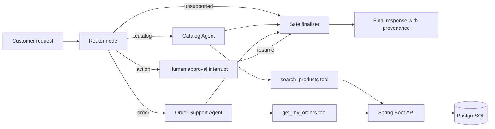

# E-Commerce AI Workflow Architecture

## Purpose

The project keeps Angular, Spring Boot, and PostgreSQL as the transactional e-commerce system. A dedicated Python agent service adds LangChain and LangGraph only for AI orchestration. This separation makes the AI workflow observable and bounded while retaining Spring Boot as the authority for identity, catalog data, orders, and all state-changing business operations.

## Runtime Components

| Component | Technology | Responsibility |
| --- | --- | --- |
| Customer and admin UI | Angular | Collects questions, displays grounded sources, and presents approval requests. |
| Core API | Spring Boot | JWT authentication, authorization, product and order APIs, validation, and persistence. |
| System of record | PostgreSQL | Stores users, products, carts, and orders. |
| Agent orchestrator | FastAPI, LangChain, LangGraph | Routes requests, invokes read-only tools, persists checkpointed workflow state, and pauses for human decisions. |
| Model provider | Existing Spring `AiProvider` or configured external provider | Provides optional natural-language generation; it is not trusted for data or authorization decisions. |

## LangGraph Workflow

The compiled graph is defined in `agent-service/app/graph.py`. `WorkflowState` in `agent-service/app/state.py` is the shared `TypedDict` passed between every node. `MemorySaver` checkpoints each session by `thread_id`, enabling a paused approval request to resume without replaying the workflow.

## Boundaries and Security

- LangGraph tools call Spring Boot APIs rather than the database directly.
- Spring Boot independently enforces JWT ownership and roles; an agent instruction cannot grant access.
- Tools are typed, allow-listed, and read-only: `search_products`, `get_product`, and `get_my_orders`.
- Order-changing, checkout, refund, or address-change language is routed to the approval interrupt. The current demonstrator records the decision and deliberately does not execute mutations.
- Responses cite returned product records. The workflow does not treat model output as a source of truth.

## Running the Demonstrator

Use Docker Compose to run PostgreSQL, Spring Boot, Angular, and the agent service together. The agent service exposes `POST /workflow` and `POST /workflow/{sessionId}/resume`. For local Python development, install `agent-service/requirements.txt` and run `uvicorn app.main:app --reload --port 8000`.
